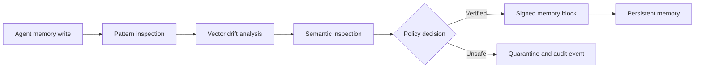

<p align="center">
  
</p>

# Mnemorix

Mnemorix is a zero-trust security console for persistent AI-agent memory. It inspects proposed memory writes, applies policy controls, records threat decisions, and maintains a tamper-evident hash chain for later verification and investigation.

[Live application](https://mnemorix.vercel.app) · [API documentation](http://localhost:8000/docs)

## Why Mnemorix

Persistent memory gives an autonomous agent useful continuity, but it also creates a durable attack surface. A hostile instruction written once can influence later sessions long after the original input has disappeared.

Mnemorix places an inspection boundary between an agent and its memory store:



## Product modules

- **Security overview** — chain integrity, protected-memory totals, blocked writes, latency, and connected-agent health.
- **Memory inspection** — interactive testing of prompt injection, memory backdoors, semantic drift, and valid writes.
- **Memory ledger** — linked block inspection, integrity audits, tamper simulation, and canonical-chain restoration.
- **Agent fleet** — agent registration, memory partitions, integrity scores, and quarantine state.
- **Policy studio** — configurable guardrails for drift thresholds, PII, canary traps, strict sealing, and pattern matching.
- **Forensic audit** — searchable security events, threat evidence, remediation history, and exportable records.
- **Copilot** — optional Gemini-backed security guidance with a local heuristic fallback.
- **Authentication and sync** — Firebase authentication and Firestore-backed account capabilities.

## Inspection model

Mnemorix evaluates a proposed write through three stages:

| Stage | Purpose | Implementation |
| --- | --- | --- |
| L1: Pattern inspection | Detect known injection, escalation, exfiltration, and backdoor patterns | Local heuristic rules |
| L2: Vector drift | Flag a write that differs significantly from the agent's established memory profile | Simulated cosine-drift scoring |
| L3: Semantic inspection | Evaluate intent and sanitize ambiguous adversarial content | Gemini when configured; heuristic fallback otherwise |

Verified writes can be appended to a SHA-256-linked ledger. Audit operations recalculate the chain and report mutations that no longer match the canonical history.

## Technology

### Frontend

- React 19 and TypeScript
- Vite 6
- Tailwind CSS 4
- Motion for React
- Recharts
- Lucide icons
- Firebase Authentication and Firestore

### Backend

- FastAPI and Pydantic
- SQLite with `aiosqlite`
- Google Generative AI integration
- SHA-256 ledger utilities
- OpenAPI documentation

## Repository structure

```text
Mnemorix/
├── src/
│   ├── components/
│   │   ├── audit/          Forensic views and incident history
│   │   ├── auth/           Authentication interface
│   │   ├── copilot/        Security assistant drawer
│   │   ├── dashboard/      Overview, metrics, events, and charts
│   │   ├── firewall/       Interactive memory inspection
│   │   ├── fleet/          Connected-agent management
│   │   ├── hashchain/      Ledger and block verification
│   │   ├── landing/        Public product website
│   │   ├── layout/         Console navigation and dialogs
│   │   └── policies/       Guardrail configuration
│   ├── context/            Application and authentication state
│   └── lib/                API, crypto, Firebase, Gemini, and types
├── backend/
│   ├── firewall/           Inspection policy engine
│   ├── routers/            FastAPI route modules
│   ├── tests/              Firewall tests
│   ├── crypto_utils.py     Ledger hashing and signatures
│   ├── database.py         SQLite initialization and seed data
│   ├── main.py             FastAPI application
│   └── models.py           Request and response models
├── public/                 Static assets
├── package.json            Frontend dependencies and scripts
└── vercel.json             Frontend/backend deployment routing
```

## Local development

### Prerequisites

- Node.js 18 or newer
- npm
- Python 3.10 or newer

### 1. Clone and install the frontend

```bash
git clone https://github.com/mfm89317855-hash/Mnemorix.git
cd Mnemorix
npm install
```

Create `.env.local` from `.env.example` and use the local API address:

```env
VITE_API_URL=http://127.0.0.1:8000
```

Start Vite:

```bash
npm run dev
```

The frontend will be available at `http://localhost:5173`.

### 2. Start the API

Open another terminal:

```bash
cd backend
python -m venv .venv
```

Activate the environment:

```powershell
# Windows PowerShell
.\.venv\Scripts\Activate.ps1
```

```bash
# macOS or Linux
source .venv/bin/activate
```

Install dependencies and run FastAPI:

```bash
pip install -r requirements.txt
python -m uvicorn main:app --host 127.0.0.1 --port 8000 --reload
```

The API will be available at `http://127.0.0.1:8000`, with interactive documentation at `http://127.0.0.1:8000/docs`.

## Environment variables

| Variable | Used by | Required | Description |
| --- | --- | --- | --- |
| `VITE_API_URL` | Frontend | Local development | FastAPI base URL. Leave unset for same-origin production routing. |
| `GEMINI_API_KEY` | Frontend/backend | No | Enables Gemini semantic inspection and Copilot responses. Fallback behavior remains available without it. |
| `FRONTEND_ORIGIN` | Backend | No | Additional CORS origin. Defaults to `http://localhost:5173`. |
| `DATABASE_URL` | Backend | No | SQLite database path. |
| `VITE_FIREBASE_API_KEY` | Frontend | No | Firebase project API key override. |
| `VITE_FIREBASE_AUTH_DOMAIN` | Frontend | No | Firebase authentication domain override. |
| `VITE_FIREBASE_PROJECT_ID` | Frontend | No | Firebase project identifier override. |
| `VITE_FIREBASE_STORAGE_BUCKET` | Frontend | No | Firebase storage bucket override. |
| `VITE_FIREBASE_MESSAGING_SENDER_ID` | Frontend | No | Firebase sender ID override. |
| `VITE_FIREBASE_APP_ID` | Frontend | No | Firebase application ID override. |
| `VITE_FIREBASE_MEASUREMENT_ID` | Frontend | No | Firebase Analytics measurement ID override. |

Never commit private API keys or backend credentials. Values prefixed with `VITE_` are included in the browser bundle and must not be treated as secrets.

## API overview

| Method | Endpoint | Purpose |
| --- | --- | --- |
| `POST` | `/api/sentinel/inspect` | Inspect a proposed memory write |
| `GET/POST` | `/api/agents` | List or register agents |
| `GET/POST` | `/api/memories` | Read or append memories |
| `PATCH` | `/api/memories/{id}/quarantine` | Quarantine a memory |
| `PATCH` | `/api/memories/{id}/restore` | Restore a memory |
| `GET` | `/api/blocks` | Read the memory ledger |
| `POST` | `/api/blocks/audit-integrity` | Verify the complete chain |
| `POST` | `/api/blocks/self-heal` | Restore the canonical chain |
| `GET` | `/api/threats` | Read threat events |
| `GET` | `/api/audit-logs` | Read forensic records |
| `GET/POST` | `/api/policies` | Read or create policies |
| `POST` | `/api/policies/evaluate` | Test content against active policies |
| `POST` | `/api/copilot/chat` | Request Copilot guidance |
| `GET` | `/api/kpis` | Read dashboard metrics |
| `GET` | `/health` | Check API health |

See [`backend/README.md`](backend/README.md) for the complete backend route reference.

## Useful commands

```bash
npm run dev       # Start the frontend development server
npm run build     # Type-check and create a production build
npm run preview   # Preview the production build locally
```

To run the backend firewall tests after installing `pytest`:

```bash
cd backend
python -m pytest tests
```

## Deployment

The repository contains a `vercel.json` configuration that routes `/api/*` requests to the FastAPI service and all remaining requests to the Vite frontend. Configure production environment variables in the deployment platform instead of committing an environment file.

For a separate frontend and backend deployment, set `VITE_API_URL` to the public API origin and set `FRONTEND_ORIGIN` on the API to the deployed frontend origin.

## Security notice

Mnemorix is a reference implementation and security research project. Its simulated vector scoring, default policies, local database, and demonstration authentication configuration should be reviewed and hardened before production use. Do not treat the included controls as a substitute for an independent security assessment.
